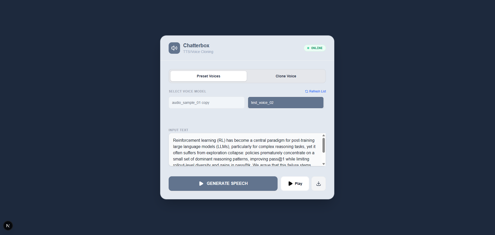
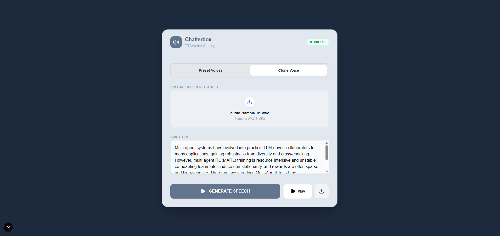

# Text2Speech/Voice Cloning (Chatterbox Turbo).

## Screenshots




## Backend

### Requirements

- Python 3.11+
- NVIDIA GPU + CUDA

### Setup

Create environment:
```
python -m venv .venv
```

Activate environment:

```
.\.venv\Scripts\Activate.ps1
```

Install PyTorch with CUDA:
```
pip install --index-url https://download.pytorch.org/whl/cu121 torch torchvision torchaudio
```

Install dependencies:

```
pip install -r requirements.txt
```

## Run API

```
uvicorn app.main:app --reload --host 127.0.0.1 --port 8000
```

### API

Base URL: `http://127.0.0.1:8000`

- `GET /health`
- `GET /tts/voices`
- `POST /tts/generate`
- `POST /tts/clone`

Drop your .wav files into backend/assets/voices/

## Frontend

### Setup

Install dependencies:

```
npm install
```

Start dev server:

```
npm run dev
```

## Author

Ville Pakarinen (@vpakarinen2)
